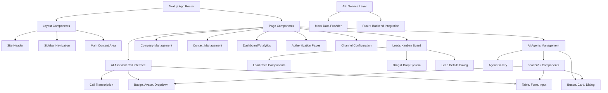

# Design Document

## Overview

The shadcn CRM system will be built as a modern, responsive web application using Next.js 13 with the App Router, shadcn/ui components, and TailwindCSS. The system follows a modular architecture with a focus on lead management through an intuitive kanban board interface, complemented by supporting modules for company management, contact management, and analytics.

The design emphasizes clean, accessible UI components that maintain consistency across all modules while providing an excellent user experience on both desktop and mobile devices. The system will initially operate with mock data and a service layer designed for seamless backend integration.

## Architecture

### High-Level Architecture



### Directory Structure

```
app/
├── (auth)/
│   ├── login/
│   └── signup/
├── dashboard/
├── leads/
├── companies/
├── contacts/
├── channels/
├── agents/
├── layout.tsx
└── page.tsx

components/
├── ui/ (shadcn components)
│   ├── button.tsx
│   ├── card.tsx
│   ├── dialog.tsx
│   ├── table.tsx
│   ├── badge.tsx
│   └── ...
├── leads/
│   ├── kanban-board.tsx
│   ├── lead-card.tsx
│   ├── lead-details-dialog.tsx
│   └── lead-filters.tsx
├── agents/
│   ├── agent-gallery.tsx
│   ├── agent-card.tsx
│   ├── agent-config-dialog.tsx
│   └── custom-agent-builder.tsx
├── ai-assistant/
│   ├── chat-widget.tsx
│   ├── call-interface.tsx
│   └── voice-controls.tsx
├── layout/
│   ├── sidebar.tsx
│   ├── header.tsx
│   └── main-nav.tsx
└── shared/
    ├── data-table.tsx
    ├── search-bar.tsx
    └── loading-spinner.tsx

lib/
├── api/
│   ├── leads.ts
│   ├── companies.ts
│   ├── contacts.ts
│   ├── agents.ts
│   └── mock-data.ts
├── types/
│   ├── lead.ts
│   ├── company.ts
│   ├── contact.ts
│   └── agent.ts
└── utils.ts
```

## Components and Interfaces

### Core Layout Components

#### Sidebar Navigation
- **Purpose**: Primary navigation for CRM modules
- **Components Used**: shadcn Button, custom navigation items
- **Features**: 
  - Collapsible on mobile
  - Active state indicators
  - Icon + text navigation items
  - Responsive behavior

#### Header Component
- **Purpose**: Top navigation with user actions and branding
- **Components Used**: shadcn Button, Avatar, Dropdown Menu
- **Features**:
  - User profile dropdown
  - Theme toggle
  - Breadcrumb navigation
  - Search functionality

### Lead Management Components

#### Kanban Board
- **Purpose**: Visual pipeline management for leads
- **Library**: @dnd-kit/core for drag-and-drop
- **Structure**:
  ```typescript
  interface KanbanColumn {
    id: string
    title: string
    leads: Lead[]
    color: string
  }
  
  interface KanbanBoardProps {
    columns: KanbanColumn[]
    onLeadMove: (leadId: string, fromColumn: string, toColumn: string) => void
    onLeadClick: (lead: Lead) => void
  }
  ```

#### Lead Card
- **Purpose**: Individual lead representation in kanban
- **Components Used**: shadcn Card, Badge, Avatar
- **Features**:
  - Drag handle
  - Status indicators
  - Deal amount display
  - Tag visualization
  - Contact icons
  - Due date alerts

#### Lead Details Dialog
- **Purpose**: Detailed view and editing of lead information
- **Components Used**: shadcn Dialog, Form, Input, Textarea, Select
- **Features**:
  - Form validation
  - Field editing
  - Save/cancel actions
  - Responsive layout

### Data Management Components

#### Data Table
- **Purpose**: Reusable table for companies and contacts
- **Components Used**: shadcn Table, Button, Checkbox
- **Features**:
  - Sorting
  - Pagination
  - Row selection
  - Action buttons
  - Responsive design

#### Search and Filter Bar
- **Purpose**: Data filtering and search functionality
- **Components Used**: shadcn Input, Select, Button
- **Features**:
  - Real-time search
  - Multiple filter options
  - Clear filters action
  - Saved filter presets

### AI Agents Management Components

#### Agent Gallery
- **Purpose**: Display and manage available AI agents
- **Components Used**: shadcn Card, Badge, Avatar, Button
- **Features**:
  - Agent status indicators
  - Performance metrics display
  - Quick actions (enable/disable)
  - Agent type categorization
  - Real-time activity indicators

#### Agent Configuration Dialog
- **Purpose**: Configure agent settings and behavior
- **Components Used**: shadcn Dialog, Form, Input, Select, Switch
- **Features**:
  - Working hours configuration
  - Channel integration settings
  - Behavior customization
  - Performance monitoring
  - Bulk configuration options

#### Custom Agent Builder
- **Purpose**: Interface for requesting custom agents
- **Components Used**: shadcn Form, Textarea, Select, Button
- **Features**:
  - Requirement specification forms
  - Template selection
  - Custom capability definition
  - Integration requirements
  - Request submission and tracking

### AI Assistant Call Interface Components

#### Call Interface Dialog
- **Purpose**: Voice call interface with the AI assistant
- **Components Used**: shadcn Dialog, Button, Progress
- **Features**:
  - Phone call-like interface
  - Call controls (mute, speaker, end call)
  - Call duration timer
  - Connection status indicator
  - Visual call state feedback

#### Voice Controls
- **Purpose**: Audio control interface during calls
- **Components Used**: shadcn Button, Slider, Badge
- **Features**:
  - Mute/unmute functionality
  - Speaker volume control
  - Audio quality indicators
  - Speaking/listening visual feedback
  - Call recording controls

#### Call Transcription
- **Purpose**: Real-time conversation transcription
- **Components Used**: shadcn ScrollArea, Badge
- **Features**:
  - Real-time text display
  - Speaker identification
  - Timestamp markers
  - Conversation history
  - Export/save functionality

## Data Models

### Lead Model
```typescript
interface Lead {
  id: string
  name: string
  company: string
  email: string
  phone?: string
  dealAmount: number
  currency: string
  stage: 'incoming' | 'decision' | 'negotiation' | 'final'
  tags: string[]
  priority: 'low' | 'medium' | 'high' | 'urgent'
  assignedTo: string
  createdAt: Date
  updatedAt: Date
  lastContactDate?: Date
  nextFollowUp?: Date
  notes?: string
  source: string
}
```

### Company Model
```typescript
interface Company {
  id: string
  name: string
  industry: string
  size: 'startup' | 'small' | 'medium' | 'large' | 'enterprise'
  website?: string
  address?: Address
  contacts: Contact[]
  deals: Lead[]
  createdAt: Date
  updatedAt: Date
}
```

### Contact Model
```typescript
interface Contact {
  id: string
  firstName: string
  lastName: string
  email: string
  phone?: string
  position?: string
  companyId: string
  avatar?: string
  socialProfiles?: SocialProfile[]
  createdAt: Date
  updatedAt: Date
}
```

### Agent Model
```typescript
interface Agent {
  id: string
  name: string
  type: 'sdr' | 'customer-service' | 'custom'
  description: string
  capabilities: string[]
  status: 'active' | 'inactive' | 'training' | 'maintenance'
  avatar?: string
  performance: {
    leadsGenerated?: number
    ticketsResolved?: number
    responseTime?: number
    satisfactionScore?: number
  }
  configuration: {
    workingHours: {
      start: string
      end: string
      timezone: string
    }
    channels: string[]
    behavior: {
      tone: 'professional' | 'friendly' | 'casual'
      responseStyle: 'concise' | 'detailed'
      escalationRules: string[]
    }
  }
  createdAt: Date
  updatedAt: Date
  lastActiveAt?: Date
}
```

### Call Session Model
```typescript
interface CallSession {
  id: string
  userId: string
  startTime: Date
  endTime?: Date
  duration?: number
  status: 'connecting' | 'active' | 'ended' | 'failed'
  transcript: {
    timestamp: Date
    speaker: 'user' | 'assistant'
    text: string
  }[]
  summary?: string
  actionItems?: string[]
  quality: {
    audioQuality: 'excellent' | 'good' | 'fair' | 'poor'
    connectionStability: number
  }
}
```

## Error Handling

### Client-Side Error Handling
- **Error Boundaries**: React error boundaries for component-level error catching
- **Form Validation**: Real-time validation with clear error messages
- **API Error Handling**: Graceful handling of network errors with user-friendly messages
- **Loading States**: Skeleton loaders and loading spinners for better UX

### Error Display Strategy
```typescript
interface ErrorState {
  type: 'network' | 'validation' | 'permission' | 'unknown'
  message: string
  action?: {
    label: string
    handler: () => void
  }
}
```

### Error Components
- **Toast Notifications**: For non-blocking error messages
- **Error Pages**: For critical errors (404, 500)
- **Inline Errors**: For form validation and field-specific errors

## Testing Strategy

### Component Testing
- **Unit Tests**: Jest + React Testing Library for individual components
- **Integration Tests**: Testing component interactions and data flow
- **Visual Regression Tests**: Storybook + Chromatic for UI consistency

### Test Coverage Areas
1. **Lead Kanban Board**:
   - Drag and drop functionality
   - Lead card rendering
   - Stage transitions
   - Responsive behavior

2. **Forms and Dialogs**:
   - Form validation
   - Data submission
   - Error handling
   - Modal interactions

3. **Data Tables**:
   - Sorting functionality
   - Pagination
   - Search and filtering
   - Row selection

4. **Navigation**:
   - Route transitions
   - Active state management
   - Mobile responsiveness

### Mock Data Strategy
```typescript
// lib/mock-data.ts
export const mockLeads: Lead[] = [
  {
    id: '1',
    name: 'Acme Corp Deal',
    company: 'Acme Corporation',
    email: 'contact@acme.com',
    dealAmount: 50000,
    currency: 'USD',
    stage: 'incoming',
    tags: ['enterprise', 'urgent'],
    priority: 'high',
    assignedTo: 'john-doe',
    createdAt: new Date('2024-01-15'),
    updatedAt: new Date('2024-01-20'),
    source: 'website'
  },
  // ... more mock data
]
```

### API Service Layer Design
```typescript
// lib/api/leads.ts
export class LeadsService {
  static async getLeads(): Promise<Lead[]> {
    // Mock implementation for development
    return mockLeads
  }
  
  static async updateLead(id: string, updates: Partial<Lead>): Promise<Lead> {
    // Mock implementation with future backend integration points
    const lead = mockLeads.find(l => l.id === id)
    if (!lead) throw new Error('Lead not found')
    
    const updatedLead = { ...lead, ...updates, updatedAt: new Date() }
    return updatedLead
  }
  
  static async moveLead(id: string, newStage: Lead['stage']): Promise<Lead> {
    return this.updateLead(id, { stage: newStage })
  }
}
```

## Design System Integration

### shadcn/ui Component Usage
- **Cards**: Lead cards, dashboard widgets, company/contact cards
- **Dialogs**: Lead details, channel configuration, confirmation modals
- **Forms**: Authentication, lead editing, search filters
- **Tables**: Company and contact listings
- **Badges**: Tags, status indicators, priority levels
- **Buttons**: Actions, navigation, form submissions

### Custom Component Extensions
- **Enhanced Card**: Lead card with drag handles and status indicators
- **Kanban Column**: Droppable container with column headers
- **Status Badge**: Color-coded badges for different lead stages
- **Priority Indicator**: Visual priority representation

### Responsive Design Approach
- **Mobile-First**: Design components for mobile, enhance for desktop
- **Breakpoint Strategy**: 
  - `sm`: 640px+ (tablet portrait)
  - `md`: 768px+ (tablet landscape)
  - `lg`: 1024px+ (desktop)
  - `xl`: 1280px+ (large desktop)

### Theme Integration
- **Dark/Light Mode**: Full support using next-themes
- **Color Palette**: Consistent with shadcn/ui design tokens
- **Typography**: Tailwind typography with consistent hierarchy
- **Spacing**: Consistent spacing scale throughout the application

This design provides a solid foundation for building a modern, scalable CRM system that can grow with future requirements while maintaining excellent user experience and code quality.